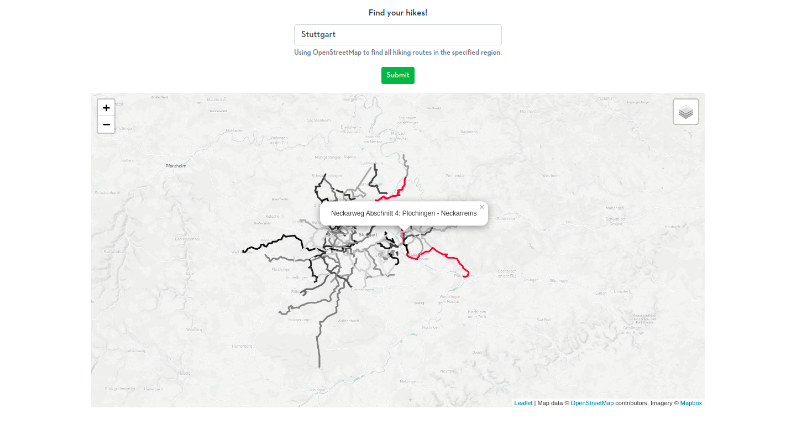

# Map-App for Hikes
TThis project contains an app for searching and visualizing hikes of a certain region. The app is deployed to Heroku:

https://vue-map-app.herokuapp.com/

### Table of Contents

1. [About Map-App](#about)
2. [Installation and Instructions](#installation)
3. [Run It Locally](#runit)
4. [File Descriptions](#files)
5. [Licensing, Authors and Acknowledgements](#licensing)

## About Map-App
This app is created in order to illustrate how to create an user interface with Vue and a backend server with Flask and Python. Moreover, it is shown how front- and backend can communicate and exchange information via a REST API and axios requests. For map visualization leaflet (vue2leaflet) is used. The goal of this project is to develop a prototype that shows how all of the mentioned tools work together without going deep for any of them. Additionally, I was interested in how to deploy such an app for which I used in this case Heroku.
  
The app allows to search for hiking routes in a dedicated region (e.g. Stuttgart) which are visualized on a geographic map subsequently. The region is entered into the Vue app and via a request to the backend server the hiking routes are obtained. The server itself makes a request to the overpass-api (accessing the Open Street Map data) and transforms the received answer into information that can be visualized by leaflet. As of now, all kind of hikes are visualized including local, national and international hikes. Once the hikes are received by the frontend, the map view is adapted to show the relevant area. If you hover over a hike the color changes and if available more information about it (like the name, description etc.) are shown.

## Installation and Instructions
The map app consists of a backend and a corresponding frontend. The backend server is created with Flask and the frontend app with the javascript framework Vue. All dependencies for the backend can be installed with python3 and the requirements.txt into a virtual environment via

`pip install -r requirements.txt`

once you created and activated a virtual environment for python3.
  
The dependencies for the frontend are dealt with in the `package.json`. This requires that npm, nodejs and Vue are installed. Once that is fulfilled, you can simply run `npm run serve` from within the frontend directory. Here are some tips how to set up npm, nodejs and Vue:

- <a href="https://www.e2enetworks.com/help/how-to-install-nodejs-npm-on-ubuntu/">Installation of npm and node js</a>
- <a href="https://cli.vuejs.org/guide/installation.html">Installation of Vue</a>

## Run It Locally
The app is deployed to Heroku but can be run of course also locally. There are two options.

- Run back- and frontend independently
- Run the app with Gunicorn as done by Heroku
### Back- and Frontend Independently
This approach requires to run the back- and frontend independently in two seperate terminals in the development mode. Execute `python server/app.py` in the first terminal and `npm run serve` in the frontend directory.

### Start Webserver with Gunicorn
This approach just requires to build the latest version of the Vue app with `npm run build` and finally to start the service with `npm start`. The underlying commands are defined in the `package.json`. This method though currently runs Vue as in production and hence the production backend-url is used and not the local address. In order to fix this you can change the address in `frontend/.env.production`.

## File Descriptions
The most important files and folders in this repository:

* `backend` - Contains the Flask server which obtains the hiking routes from OSM.

* `frontend` - Contains the user interface which is implemented here as a Vue app.

* `package.json` - Manages dependencies of the frontend and npm commands.

* `runtime.txt` - Tells Heroku which python to use.

* `Procfile` - Command executed by heroku to start the entire app.

* `.env` - Environment file defining the FLASK_APP.

* `backend/server/app.py` - This python file hosts the webapp via flask.

* `backend/server/helpers.py` - Helper functions for the OSM data handling and request to the overpass api.

* `frontend/src/components/MapView.vue` - JVue file defining the map component.

## Licensing, Authors and Acknowledgements

  
Thanks <a href="https://blog.logrocket.com/setting-up-an-online-store-with-flask-and-vue/">Raphael Ugwu</a> for the first heads-up for setting up an app with Flask and Vue.